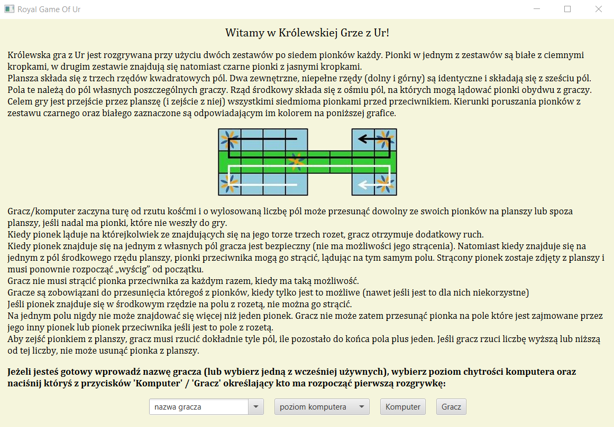
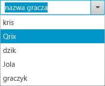
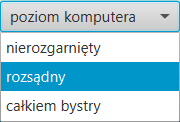
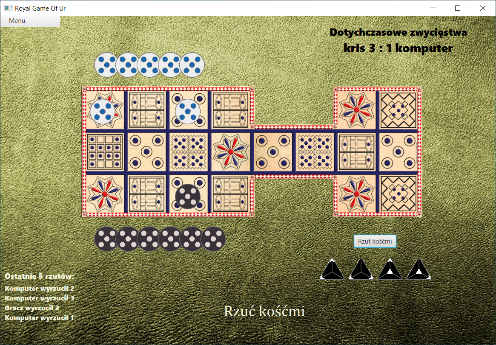
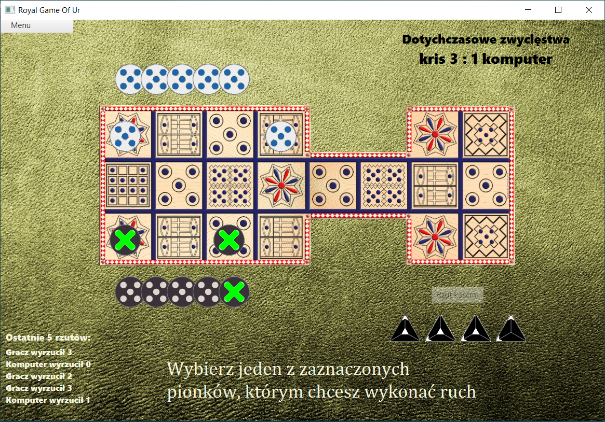
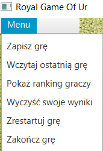
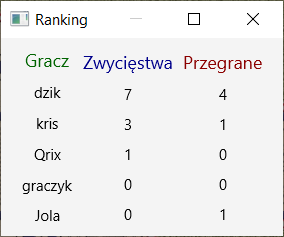

# Royal-Game-Of-Ur 
The Royal Game of Ur, also known as the Game of Twenty Squares or simply the Game of Ur, is a two-player strategy race board game that was first played in ancient Mesopotamia during the early third millennium BC.
More about the game you can read here:
[Link to Wikipedia article](https://en.wikipedia.org/wiki/Royal_Game_of_Ur)

In the relevant version of the game you can play against a computer.

On the start page there is brief description of the rules. 

You can input there the name of a new player or choose already existing one from the list. 

You can also choose one of the 3 computer AI levels. 

By clicking corresponding button you can start the game with computer's or player's first move. 

On a game screen, in addition to game board, there are displayed simple instructions for the player, 
current score and information about the last 5 results of computer's and player's dice throws.   

Using the top-left menu you can save current game or load the last which player saved, 
reset player's score as well as restart or end the game. 

Additionally, you can also display current players' rank.

